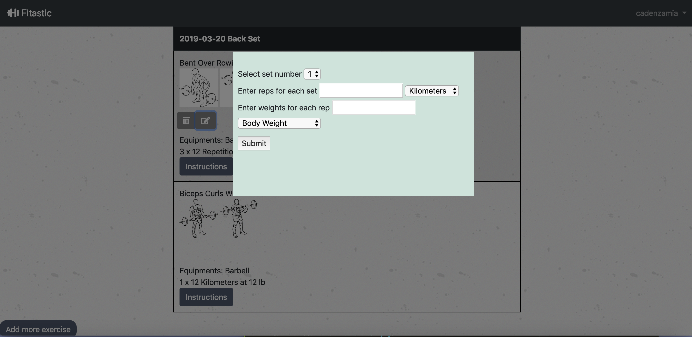
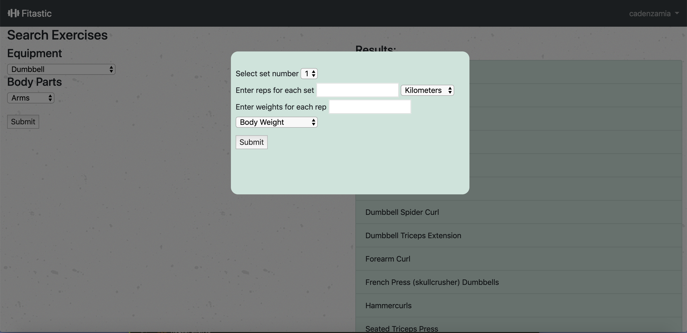

# Fitastic
## Project Description
Fitastic tailors exercise recommendations based on user's preferences - targeted body parts and available equipments. It allows users to customize their workout schedules by selecting exactly which exercises they would like to do, specify how many sets, repetitions and weights. Multiple Ajax requests are used in the selection process to achieve smooth user experience. By leveraging on Javascript library FullCalendar, it offers users a much more convenient and flexible way to reschedule, preview, or modify existing workouts.
## About the Developer
Fitastic was developed by Miao Ran Ren, a software engineer based in San Francisco Bay Area. Learn more about the developer on [LinkedIn](https://www.linkedin.com/in/mia-miao-ren-71b19a87/).
## Tech Stack
Python, Flask, SQLAlchemy, HTML, CSS, Jinja, JavaScript, jQuery and AJAX, PostgreSQL, Bootstrap
## API Used
Wger API(exercise data, including equipment, images, body parts, rep unit, weight unit).
## Features 


A motivative call-to-action button and phrase on the landing page not only attract users and also communicates to users about the major features about this web app: customize workout and provide a scheduling tool on calendar.


After logged in, the main dashboard shows today's workout schedule with detailed info and a calendar where user can hover over to preview past or future saved workout. This calendar is called FullCalendar, a Javascript Event Calendar.


On the calendar, user can drag and drop one workout to reschedule to a different day. This needs AJAX request so that Javascript code can continue working on the page while updating database is happening in the backgroud.


On the calendar, user can click into certain workout to see more details, make modifications, such as adding more exercises by clicking "Add more exercise" button.


After entering day workout view, user can hoverover to click the "Delete" logo to delete selected exercise from her workout schedule. This needs AJAX request so that Javascript code can continue working on the page while querying and updating database is happening in the backgroud.



After entering day workout view, user can hoverover to click the "Update" logo to update detailed info (rep, weight, set) for selected exercise. This needs AJAX request so that Javascript code can continue working on the page while querying and updating database is happening in the backgroud.


After entering day workout view, user can click the modal box to see more detailed instructions for selected exercise. This needs AJAX and Javascript to dynamically display corresponding exercises. (this feature also available on today's workout schedule on the main dashboard.)


On the main dashboard, user can click "choose a training day" to create a new workout, add description to that workout. 





After user finishes choosing the training date, while guiding the user select exercises based on perferences - body parts they want to focus on, and available equipments, multiple AJAX requests are done so that exercises could dynamically display and user could add multiple exercises to the workout without reloading the page. Even more, user could specify the rep, set, weight info for the selected exercise on the current page to achieve smooth user experience.


## Setup/Installation

### Requirements

* PostgreSQL
* Python 3.6

Please follow the below steps to have this app running on your computer:

Clone repository:

```
$ git clone https://github.com/miaoranren/hb_project_workoutplan
```

Create a virtual environment:

```
$ virtualenv env
```

Activate the virtual environment:

```
$ source env/bin/activate
```

Install dependencies:

```
$ pip3 install -r requirements.txt
```

Create database 'workoutplan':

```
$ createdb workoutplan
```

Create your Python-based ORM:

```
$ python3 model.py
```

Load necessary exercises data from Wger API

```
$ python3 api.py
```

Run the app from the command line:

```
$ python3 server.py
```

## Looking Forward
* 
* 
